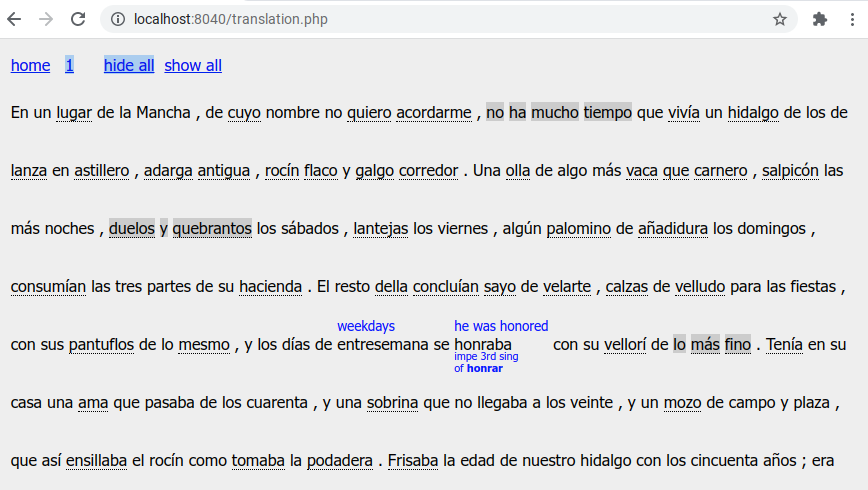

# traduciendo
A tool that you can use as part of your language learning .
 
This program is not uploaded yet; here is a preview of how it works .. let me know if you're interested.
 
You start by importing some text from the language that you are studying.
 
Then, as you read the text, you add translations for individual words or phrases that you don't know.
 
These translated words can be hidden, displayed individually, or they can all be set to display.
 
In this sample text, I am translating Spanish into English.
 
However, the program can be used for any language .. the program doesn't start with any knowledge; it is all built up by you.
 

 
Here is the editing for one word .. the grammar elements can be changed for different languages.
 

 
 
